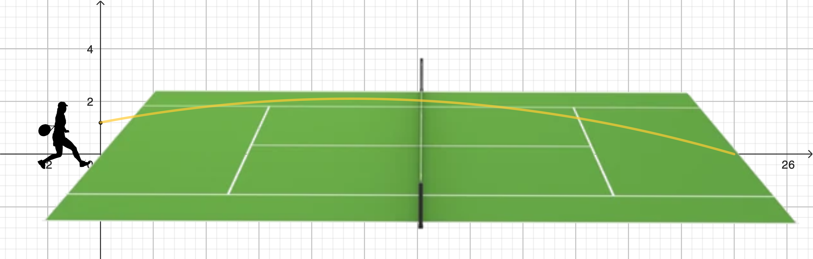


    Herr Müller ist leidenschaftlicher Tennisspieler. Als er von seinem letzten Tennisspiel erzählt, fällt den Schüler:innen auf, dass der Ball beim Schlag eine gekrümmte Flugbahn beschreibt. Im Matheunterricht stellt die Lehrkraft die Frage: _„Wie kann man diese Flugkurve mathematisch beschreiben und vorhersagen?“_


## Vorwort

Die vorliegende Lernsituation knüpft an ein alltägliches Sporterlebnis an und nimmt die Flugbahn eines Tennisballs zum Ausgangspunkt. Durch die Verbindung von Mathematik und eine solche reale Situation wird deutlich, dass mathematische Konzepte wie quadratische Funktionen nicht nur abstrakte Inhalte sind, sondern reale Phänomene erklären und vorhersagen können.

Die Auseinandersetzung mit der Flugkurve des Tennisballs fördert zentrale mathematische Kompetenzen:

- **Darstellungskompetenz**, durch das Anfertigen von Skizzen und das Arbeiten mit Koordinatensystemen.

- **Argumentations- und Problemlösekompetenz**, indem Eigenschaften der Funktion (Scheitelpunkt, Nullstellen) analysiert und deren Bedeutung im Kontext gedeutet werden.

- **Kommunikationskompetenz** durch den Austausch über Ergebnisse und deren Interpretation im sportlichen Zusammenhang.

- **Modellierungskompetenz**, indem eine reale Bewegung in ein mathematisches Modell (quadratische Funktion) übertragen wird.

Die Lernsituation zeigt somit beispielhaft, wie Mathematik zum Verstehen und Erklären alltäglicher Erscheinungen beiträgt und fördert gleichzeitig ein tieferes Verständnis für die Bedeutung quadratischer Funktionen.

## Szenarien und Aufgaben


    Die Flugbahn des Tennisball bei einem Grundlinienschlag kann durch die folgende Funktionsgleichung beschrieben werden:
    $f(x) = -0,01 x^2 + 0,19x + 1,2$.



    <li><b>Bestimme</b> die Höhe, in der der Spieler den Ball trifft.</li>
    <li><b>Berechne</b> die Höhe, in der der Ball über das Netz fliegt, wenn der Spieler den Ball exakt an der Grundlinie eines genormten Tennisplatzes trifft.</li>
    <li><b>Überprüfe</b>, ob der Schlag im Feld landet.</li>
