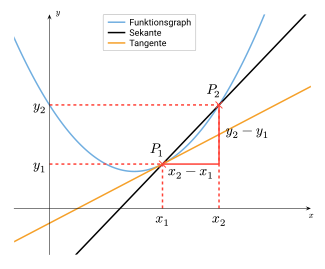
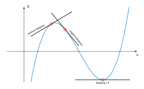

## Wiederholung: Differenzenquotient

Der Differenzenquotient entspricht der Steigung einer Geraden durch zwei Punkte, die auf dem Graphen einer Funktion liegen. Es handelt sich hierbei um eine Sekante, weshalb man auch von der sog. **Sekantensteigung** spricht.

Du erinnerst dich hoffentlich noch daran, wie du die Steigung einer linearen Funktion bestimmt hast, wenn zwei Punkte gegeben waren. Hier hast du ein **Steigungsdreieck** gebildet und im Grunde nichts anderes gemacht.

Das Bilden des Differenzenquotienten ist ein Zwischenschritt bei der <mark>Bestimmung der Steigung einer Kurve in einem Punkt</mark>.

## Einstieg

In der nachfolgenden Applet kannst du selbst experimentieren und herausfinden, wie man von der mittleren Änderungsrate zur lokalen Änderungsrate gelangt.

Lies dir zunächst die Aufgabe durch, bevor du mit dem Experimentieren beginnst.




Der Punkt $P_1$, welcher auf dem Graphen von $f$ liegt, wird festgelegt durch den Wert von $x_1$, der dessen x-Koordinate darstellt. Einmal eingestellt, soll dieser fest sein und nicht mehr bewegt werden.

Der Punkt $P_2$ hingegen - für den der Schieberegler $x_2$ vorhanden ist - soll sich dem Punkt $P_1$ nähern.

1. **Verschiebe** mit Hilfe des Schiebereglers $x_2$ den Punkt $P_2$ langsam in Richtung des Punktes $P_1$ und **beobachte**, wie sich die Steigung der Sekante verändert.
2. **Notiere** dir die einzelnen Ergebnisse tabellarisch in dein Heft.
3. **Blende** anschließend die Tangente **ein** und **erkläre**, inwiefern die Steigung der Sekante und die der Tangente zusammenhängen.
4. Sind die x-Koordinaten beider Punkte identisch, dann passiert etwas. **Erkläre** dies in deinen eigenen Worten.


## Vom Differenzenquotient zum Differentialquotient

Zur Bestimmung der Steigung in einem Punkt -- der sog. **momentanen** bzw. **lokalen Änderungsrate** -- nähert man den Punkt $P_2$ dem Punkt $P_1$ an. Dabei nähert sich die Steigung der Sekante schrittweise der Steigung der **Tangente** und die Sekante wird schlussendlich zur Tangente.

*Abb. 1: Von der Sekante zur Tangente*

Mathematisch betrachtet verbirgt sich hinter dieser Annäherung der **Grenzwert der Sekantensteigung**.


Der **Grenzwert** (Limes, Abk. $\lim$) beschreibt, welchem Wert sich eine Funktion oder Folge nähert, wenn sich die $x$-Werte (bzw. Folgenglieder) einer bestimmten Stelle nähern oder gegen unendlich laufen. Der Limes einer Funktion $f(x)$ an einer Stelle $x_0$ ist derjenige Wert, dem sich $f(x)$ nähert, wenn $x$ gegen $x_0$ läuft.

Notation: \
$\displaystyle \lim_{x \to x_0} f(x) = a$

$a$ bezeichnet hierbei den Grenzwert der Funktion $f(x)$ an der Stelle $x_0$.


Man spricht das so: \
"Limes für x gegen x Null von f von x gleich a."


Es gilt:

$\displaystyle m = \lim_{x_2 \to x_1} \frac{y_2-y_1}{x_2-x_1}$

bzw. wenn man für $y_1 = f(x_1)$ und für $y_2 = f(x_2)$ einsetzt:

$\displaystyle m = \lim_{x_2 \to x_1} \frac{f(x_2)-f(x_1)}{x_2-x_1}$.


$m$ -- also der Wert des Differentialquotienten -- entspricht hierbei der **lokalen Änderungsrate**.


Die **lokale Änderungsrate** von $f$ an der Stelle $x_0$ entspricht der Steigung der Tangente an dem Graphen von $f$ im Punkt $P\left(x_0|f(x)\right)$.

Die lokale Änderungsrate heißt auch **Ableitung der Funktion an der Stelle $x_0$**.

Geschrieben $f'(x_0)$ (gesprochen: "f Strich von x null").


<!-- Die lokale bzw. momentane Änderungsrate einer Funktion entspricht der **Steigung der Tangenten** am Graphen in einem bestimmten Punkt. -->

Mit Hilfe der lokalen Änderungsrate kann man die Steigung in jedem beliebigen Punkt einer Kurve bestimmen.

## Differentialquotient und h-Methode

Schreibt man für die Stelle $x_2 = x_1 + h$ (dabei geht man quasi davon aus, dass $x_2$ einen Abstand $h$ zu $x_1$ hat), so erhält man für den Differentialquotienten eine andere Schreibweise, die sog. **h-Methode**:


Schreibweise des Differentialquotienten mit der **h-Methode**:

$\displaystyle m = \lim_{h \to 0} \frac{f(x_1+h)-f(x_1)}{x_1+h-x_1}$

Und kürzt man nun noch den Nenner, so lautet die Formel:

$\displaystyle m= \lim_{h \to 0} \frac{f(x_1+h)-f(x_1)}{h}.$





Auch hier soll sich der Punkt $P_1$ schrittweise dem Punkt $P_2$ nähern.

1. **Lege** zunächst einmal einen Wert für $x_1$ und eine Funktionsgleichung **fest** und **verschiebe** anschließend mit Hilfe des Schiebereglers $h$ den Punkt $P_2$ langsam in Richtung des Punktes $P_1$ und **beobachte**, wie sich die Steigung der Sekante verändert.
2. **Notiere** dir neben der Funktionsgleichung und dem Wert von $x_1$ auch einzelne Ergebnisse tabellarisch in dein Heft. **Stelle** anschließend eine *begründete* Vermutung auf, welchem Wert sich die Werte der Sekantensteigung nähern.
3. Welche Unterschiede im Vergleich zur letzten Applet kannst du erkennen? **Notiere** deine Ergebnisse in Stichworten.


Der Differentialquotient ist die Ableitung $f’(x_1)$ der Funktion $f(x)$ an der Stelle $x_1$. Die erste Ableitung einer Funktion an der Stelle $x_1$ gibt die **Steigung der Tangente an den Funktionsgraphen** im Punkt $P(x_1|f(x_1))$ an.

## Ableitung und ihre Bedeutung

Die erste Ableitung einer Funktion $f$ an einer Stelle $x_0$ gibt die momentane Änderungsrate des Funktionsgraphen an dieser Stelle an -- geometrisch gesehen also die Steigung der Tangente an den Graphen. Die Ableitung der Funktion $f(x)$ wird mit $f'(x)$ bezeichnet.


Weitere Ableitungen bezeichnet man $f''(x)$, $f'''(x)$, usw.




- Ist $f’(x_0) > 0$, so **steigt** der Graph an dieser Stelle.
- Ist $f’(x_0) < 0$, so **fällt** der Graph an dieser Stelle.
- Ist $f’(x_0) = 0$, so hat der Graph an dieser Stelle keine Steigung (Steigung gleich Null).



*Abb. 2. verschiedene Steigungen am Graphen*

Die Ableitung ist ein wichtiges Hilfsmittel zur Bestimmung von besonderen Stellen eines Graphen. Ebenso gibt sie Auskunft über den Verlauf des Graphen.

Mit Hilfe der ersten Ableitung bestimmt man außerdem mögliche **Extremstellen**. Mehr dazu im Kapitel ["Funktionsuntersuchung"](hbf1/4-funktionsuntersuchung/vollständige-kurvendiskussion/).

## Interpretation der lokalen Änderungsrate im Beispielkontext



| Bsp.e für Funktionen | mittlere Änderungsrate | lokale Änderungsrate |
| --- | --- | --- |
| Zeit → zurückgelegter Weg | Durchschnittsgeschwindigkeit | Momentangeschwindigkeit  |
| Entfernung → Höhe | Durchschnittshöhe | Momentane Steigung |



<!-- *Tab.1: mittlere und lokale Änderungsrate in Anwendungskontexten* -->
