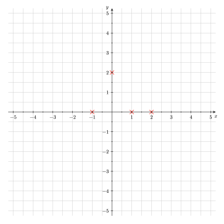

Hier lernst du Schritt für Schritt, wie du eine Funktion vollständig untersuchst.
Wozu das gut ist, erfährtst du danach in einem [Anwendungsbeispiel](/hbf1/4-funktionsuntersuchung/anwendungsbeispiel/).

## Definitionsbereich

Den <mark>Definitionsbereich</mark> einer Funktion bestimmt man, da es nur innerhalb dieses Bereiches sinnvoll ist, Untersuchungen über die Eigenschaften jener Funktion anzustellen.


Umgangssprachlich ausgedrückt umfasst der Definitionsbereich alle $x$-Werte (Argumente), die man in die Funktion einsetzen darf.
Je nach Funktionsgleichung gibt es dafür Einschränkungen.
<!-- Sprich: "Man darf alles einsetzen." -->

Im Allgemeinen gilt jedoch: $\quad \mathbb{D}(f) = \mathbb{R}$.

Oder anders ausgedrückt: Man darf alle reellen Zahlen ($\mathbb{R}$) einsetzen.



Wie bereits erwähnt gibt es jedoch auch Ausnahmen. Hier siehst du zwei Beispiele:

- **Wurzelfunktionen** wie z.B. $f(x) = \sqrt{𝑥}$:
    - Vielleicht erinnerst du dich an folgende Regel: Aus einer negativen Zahl kann man im Bereich der reellen Zahlen nur dann eine Wurzel ziehen, wenn der Wurzelexponent ungerade ist. Ist der Wurzelexponent gerade (wie das bei der Quadratwurzel $\sqrt{}$ der Fall ist), ist die Wurzel aus einer negativen Zahl nicht definiert.
    - Es gilt deshalb $\mathbb{D}(f) = \mathbb{R}_0^+$.
    - Umgangssprachlich ausgedrückt: Man darf alle positiven Zahlen inklusive der Null einsetzen.
- **gebrochen-rationale Funktionen** wie bspw. $f(x) = \frac{1}{x}$:
    - Durch Null zu teilen ist in der Mathematik nicht möglich und nicht definiert, da es widersprüchliche und nicht eindeutige Ergebnisse liefern würde.
    - Deshalb gilt: $\mathbb{D}(f) = \mathbb{R}\backslash \{0\}$.
    - Umgangssprachlich ausgedrückt: Man darf alle Zahlen (egal ob positiv oder negativ) außer der Null einsetzen.


## Achsenschnittpunkte

Wenn geklärt ist, wie der Definitionsbereich der Funktion lautet, dann überprüft man den Graphen der Funktion zunächst auf dessen <mark>Schnittpunkte mit den Koordinatenachsen</mark>:

- **Schnittpunkt mit der y-Achse:** \
Eine Funktion kann einen Schnittpunkt mit der $y$-Achse haben, muss aber nicht zwingend. Ein Beispiel hierfür ist die Funktion $f(x)=\frac1x$.

- **Schnittpunkte mit der x-Achse:** \
Man spricht hierbei von den sog. Nullstellen einer Funktion. Anders als bei der Begrifflichkeit Schnittpunkt bezeichnet eine Nullstelle lediglich den $x$-Wert (Stelle) eines Schnittpunkts mit der $x$-Achse. Alle Schnittpunkte mit der $x$-Achse haben die Form $(x_i|0)$, wobei $x_i$ hier repräsentativ für alle Nullstellen der Funktion steht.



- **Schnittpunkt mit der $y$-Achse:** \
$f(0)$ bestimmen $\quad \Rightarrow P(0|f(0))$

- **Schnittpunkte mit der $x$-Achse:** \
$f(x) = 0$ setzen und alle Nullstellen $x_i$ ausrechnen $\quad \Rightarrow (x_i|0)$



## Symmetrieeigenschaften

Die <mark>Symmetrieeigenschaft</mark> einer Funktion beschreibt, ob ihr Graph bei einer Spiegelung oder einer Drehung unverändert bleibt.

Dies führt zu zwei Haupttypen von Symmetrie:

- **Achsensymmetrie:**
    - Spiegelung an einer Achse (meist der $y$-Achse)
    - Notation: $f(x) = f(-x)$
- **Punktsymmetrie:**
    - Spiegelung an einem Punkt (meist dem Koordinatenursprung)
    - Notation: $f(-x) = -f(x)$.

Bei ganzrationalen Funktionen kann die Symmetrie oft durch Betrachtung der (geraden oder ungeraden) Exponenten des Funktionsterms bestimmt werden:

- Hat eine Funktionsgleichung nur **gerade Exponenten**, so liegt eine **Achsensymmetrie** vor.
- Hat eine Funktionsgleichung ausschließlich **ungerade Exponenten**, so handelt es sich um eine **Punktsymmetrie** zum Koordinatenursprung.

## Extrempunkte

Zunächst Ableitungen bilden.

to be continued...

## Wendepunkte

to be continued...

<!-- ## Steigungs-, Krümmungs- und Monotonieverhalten

to be continued... -->

## Globalverhalten

to be continued...

## Skizze

Schlussendlich bietet es sich an, eine <mark>Skizze des Graphen</mark> anzufertigen. Hierzu ist weder eine genaue Zeichnung noch das Erstellen einer Wertetabelle erforderlich. Auf Basis der vorangegangenen Untersuchungspunkte lässt sich der Graph der Funktion bereits sehr gut und reduziert auf seine wesentlichen Merkmale bzw. Punkte skizzieren.

Um deine Ergebnisse zu überprüfen, kannst du gerne das nachfolgende GeoGebra-Widget nutzen:


