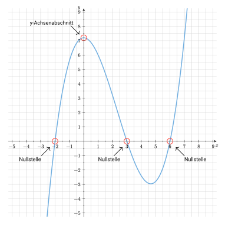
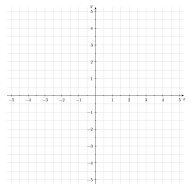
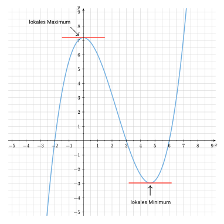

Hier lernst du Schritt für Schritt, wie du eine Funktion vollständig untersuchst.
Wozu das gut ist, erfährtst du danach in einem [Anwendungsbeispiel](/hbf1/4-funktionsuntersuchung/anwendungsbeispiel/).


    Nachfolgend betrachten wir beispielhaft die Funktion $f(x)=0,2x^3 - 1,4x^2 +7,2$ und führen eine vollständige Kurvendiskussion durch.


## Definitionsbereich

Den <mark>Definitionsbereich</mark> einer Funktion bestimmt man, da es nur innerhalb dieses Bereiches sinnvoll ist, Untersuchungen über die Eigenschaften jener Funktion anzustellen.


Umgangssprachlich ausgedrückt umfasst der Definitionsbereich alle $x$-Werte (Argumente), die man in die Funktion einsetzen darf.
Je nach Funktionsgleichung gibt es dafür Einschränkungen.
<!-- Sprich: "Man darf alles einsetzen." -->

Im Allgemeinen gilt jedoch: $\mathbb{D}(f) = \mathbb{R}$.

Oder anders ausgedrückt: Man darf alle reellen Zahlen ($\mathbb{R}$) einsetzen.



    Auch bei der Funktion $f(x)=0,2x^3 - 1,4x^2 +7,2$ gilt: \
    $\mathbb{D}(f) = \mathbb{R}$.



Wie bereits erwähnt gibt es jedoch auch Ausnahmen. Hier siehst du zwei Beispiele:

- **Wurzelfunktionen** wie z.B. $f(x) = \sqrt{𝑥}$:
    - Vielleicht erinnerst du dich an folgende Regel: Aus einer negativen Zahl kann man im Bereich der reellen Zahlen nur dann eine Wurzel ziehen, wenn der Wurzelexponent ungerade ist. Ist der Wurzelexponent gerade (wie das bei der Quadratwurzel $\sqrt{}$ der Fall ist), ist die Wurzel aus einer negativen Zahl nicht definiert.
    - Es gilt deshalb $\mathbb{D}(f) = \mathbb{R}_0^+$.
    - Umgangssprachlich ausgedrückt: Man darf alle positiven Zahlen inklusive der Null einsetzen.
- **gebrochen-rationale Funktionen** wie bspw. $f(x) = \frac{1}{x}$:
    - Durch Null zu teilen ist in der Mathematik nicht möglich und nicht definiert, da es widersprüchliche und nicht eindeutige Ergebnisse liefern würde.
    - Deshalb gilt: $\mathbb{D}(f) = \mathbb{R}\backslash \{0\}$.
    - Umgangssprachlich ausgedrückt: Man darf alle Zahlen (egal ob positiv oder negativ) außer der Null einsetzen.


## Achsenschnittpunkte

Wenn geklärt ist, wie der Definitionsbereich der Funktion lautet, dann überprüft man den Graphen der Funktion zunächst auf dessen <mark>Schnittpunkte mit den Koordinatenachsen</mark>:

- **Schnittpunkt mit der y-Achse:** \
Eine Funktion kann einen Schnittpunkt mit der $y$-Achse haben, muss aber nicht zwingend.
Ein Beispiel für eine Funktion, welche keinen Schnittpunkt mit der $y$-Achse besitzt, ist die Funktion $f(x)=\frac1x$.

- **Schnittpunkte mit der x-Achse:** \
Man spricht hierbei von den sog. Nullstellen einer Funktion. Anders als bei der Begrifflichkeit Schnittpunkt bezeichnet eine Nullstelle lediglich den $x$-Wert (Stelle) eines Schnittpunkts mit der $x$-Achse. Alle Schnittpunkte mit der $x$-Achse haben die Form $(x_i|0)$, wobei $x_i$ hier repräsentativ für alle Nullstellen der Funktion steht.



- **Schnittpunkt mit der $y$-Achse:** \
$f(0)$ bestimmen $\quad \Rightarrow P(0|f(0))$

- **Schnittpunkte mit der $x$-Achse:** \
$f(x) = 0$ setzen und alle Nullstellen $x_i$ ausrechnen $\quad \Rightarrow (x_i|0)$




    Auf der nachfolgenden Abbildung siehst du die jeweiligen Achsenschnittpunkte markiert.
    

- Den $y$-Achsenabschnitt erhält man, indem man entweder $f(0)$ bestimmt oder einfach das Absolutglied der Funktionsgleichung betrachtet: $7,2$ \
$\Rightarrow S_y(0|7,2)$.
- Die Nullstellen des Funktionsgleichung erhält man, indem man eine Polynomdivision durchführt und anschließend die p-q-Formel anwendet: \
$\Rightarrow x_1=-2, \quad x_2=3, \quad x_3=6$.


## Symmetrieeigenschaften

Die <mark>Symmetrieeigenschaft</mark> einer Funktion beschreibt, ob ihr Graph bei einer Spiegelung oder einer Drehung unverändert bleibt.

Dies führt zu zwei Haupttypen von Symmetrie:

- **Achsensymmetrie** (siehe grüner Graph):
    - Spiegelung an einer Achse (meist der $y$-Achse)
    - Notation: $f(x) = f(-x)$
- **Punktsymmetrie** (roter Graph):
    - Spiegelung an einem Punkt (meist dem Koordinatenursprung)
    - Notation: $f(-x) = -f(x)$.


    
        
    
    
        
    


Bei ganzrationalen Funktionen kann die Symmetrie oft durch Betrachtung der (geraden oder ungeraden) Exponenten des Funktionsterms bestimmt werden:

- Hat eine Funktionsgleichung nur **gerade Exponenten**, so liegt eine **Achsensymmetrie** vor.
- Hat eine Funktionsgleichung ausschließlich **ungerade Exponenten**, so handelt es sich um eine **Punktsymmetrie** zum Koordinatenursprung.


In diesem Fall liegt weder eine Achsensymmetrie noch eine Punktsymmetrie vor, da die Funktionsgleichung sowohl ungerade ($x^3$) als auch gerade Exponenten ($x^2$ und $x^0$) enthält.

Formal betrachtet kann man dies wie folgt nachweisen:

- Zunächst bildet man $f(-x)$: \
$f(-x) = 0,2 \cdot (-x)^3 - 1,4 \cdot (-x)^2 + 7,2 = -0,2x^3 - 1,4x^2 +7,2$
- Nun vergleicht man $f(-x)$ mit $f(x)$: \
$f(-x) = -0,2x^3 - 1,4x^2 +7,2 \neq 0,2x^3 - 1,4x^2 +7,2 = f(x)$
- Da $f(x) \neq f(-x)$ gilt, haben wir nachgewiesen, dass keine Achsensymmetrie vorliegt.

Analog funktioniert dies auch für den Nachweis der Punktsymmetrie (welche ebenfalls nicht vorliegt) mit dem Vergleich von $f(-x)$ und $-f(x)$.


## Extrempunkte

### Schritt 1

Zunächst bildet man die ersten drei Ableitungen der gesuchten Funktion. Wenn dir die Ableitungsregeln nicht mehr bekannt sind, dann wirf noch einmal einen Blick in das Kapitel "Grundlagen der Differentialrechnung" auf die Seite ["Erste Ableitungsregeln"](hbf1/3-grundlagen-der-differentialrechnung/erste-ableitungsregeln/).


1. Ableitung: \
$f'(x)=0,6x^2-2,8x$
2. Ableitung: \
$f''(x)=1,2x-2,8$
3. Ableitung: \
$f'''(x)=1,2$


### Schritt 2

Als nächstes kümmern wir uns um die sogenannte <mark>notwendige Bedingung</mark>:


Die **notwendige Bedingung für eine Extremstelle** einer differenzierbaren Funktion ist, dass die erste Ableitung ($f'(x)$) an dieser Stelle gleich Null ist ($f'(x) = 0$), da die **Tangente** an dieser Stelle **waagerecht** ist (und ihre Steigung somit Null ist).


Auf der nachfolgenden Grafik sind diejenigen Stellen des Funktionsgraphen markiert, an denen eine waagerechte Tangente vorliegt:

Um diejenigen Stellen bestimmen zu können, an denen die Tangente waagerecht ist, müssen wir als nächstes die <mark>Nullstellen der ersten Ableitung bestimmen</mark>.


Die erste Ableitung einer Funktion $f(x)$ -- bezeichnet als $f'(x)$ -- gibt die **momentane Steigung** des Funktionsgraphen der Funktion an einer bestimmten Stelle an.

Sie beschreibt die momentane Änderungsrate und ermöglicht die **Berechnung, wie steil der Graph in jedem Punkt ist**. Dies ist für die Ermittlung von Extrempunkten (Hoch- und Tiefpunkten) wichtig und für das Verständnis des Verhaltens des Funktionsgraphen (ob dieser steigend oder fallend ist) entscheidend.



Zur Erinnerung: \
$f'(x)=0,6x^2-2,8x$

Notwendige Bedingung:

$\begin{aligned}
&&f'(x) &=0 \\\
\Leftrightarrow &&0,6x^2-2,8x &= 0 \\\
\Leftrightarrow &&x \cdot (0,6x-2,8) &= 0
\end{aligned}$

$\Rightarrow &&x_1=0, \quad 0,6x_2-2,8=0 \\\
\Leftrightarrow &&x_1=0, \quad x_2 \approx 4,67$


### Schritt 3


Dass die erste Ableitung an derjenigen Stelle des Funktionsgraphen gleich Null ist, an der sich eine Extremstelle befindet, ist jedoch **keine hinreichende Bedingung**. An solchen Stellen kann nämlich anstatt eines Hoch- oder Tiefpunkts auch ein sogenannter **Sattelpunkt** vorliegen.

Zur Überprüfung, ob tatsächlich ein Extrempunkt vorliegt, wird daher die zweite Ableitung ($f''(x)$) herangezogen:

- Ist $f''(x) < 0$ so liegt ein Hochpunkt vor,
- ist $f''(x) > 0$, handelt es sich um einen Tiefpunkt und
- wenn $f''(x) = 0$ ist, dann liegt ein Sattelpunkt vor.




Wenn $f'(x) = 0$ und gleichzeitig $f''(x) = 0$ ist, dann liegt kein Extrempunkt, sondern ein **Sattelpunkt** (auch *Terrassenpunkt* genannt) vor, bei dem die **Tangente waagerecht** ist, **aber kein lokales Maximum oder Minimum** vorliegt.


### Schritt 4

Wir müssen noch die $y$-Werte der Extremstellen ausrechnen.

## Wendepunkte

to be continued...

<!-- ## Steigungs-, Krümmungs- und Monotonieverhalten

to be continued... -->

## Globalverhalten

to be continued...

## Skizze

Schlussendlich bietet es sich an, eine <mark>Skizze des Graphen</mark> anzufertigen. Hierzu ist weder eine genaue Zeichnung noch das Erstellen einer Wertetabelle erforderlich. Auf Basis der vorangegangenen Untersuchungspunkte lässt sich der Graph der Funktion bereits sehr gut und reduziert auf seine wesentlichen Merkmale bzw. Punkte skizzieren.

Um deine Ergebnisse zu überprüfen, kannst du gerne das nachfolgende GeoGebra-Widget nutzen:


