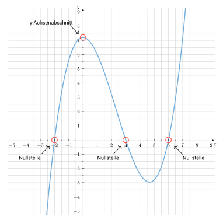

In diesem Abschnitt lernst du Schritt für Schritt einer vollständigen Funktionsuntersuchung kennen. Einzelne davon hast du bereits in den vorherigen Abschnitten kennengelernt. Diese werden nun durch weitere Aspekte ergänzt.

1. Definitionsbereich
1. Achsenschnittpunkte
1. Symmetrieeigenschaft
1. Extrempunkte
1. Wendepunkte
1. Globalverhalten
1. Skizze

Damit du all diese Schritte anschaulich nachvollziehen kannst, führen wir in diesem Abschnitt eine **vollständige Kurvendiskussion** anhand eines Beispiels durch.


    Nachfolgend betrachten wir beispielhaft die Funktion $f(x)=0,2x^3 - 1,4x^2 +7,2$ und führen eine vollständige Kurvendiskussion durch.


## 1. Definitionsbereich

Zur vollständigen Beschreibung einer Funktion -- wie das bei vollständigen Kurvendiskussion der Fall ist -- gehört die Angabe des <mark>Definitionsbereichs</mark>. Diesen bestimmt man, da es nur innerhalb dieses Bereiches sinnvoll ist, Untersuchungen über die Eigenschaften jener Funktion anzustellen.


Der **Definitionsbereich** einer Funktion $f$ -- geschrieben: $\mathbb{D}(f)$ -- ist die Menge aller $x$-Werte,
für die die Funktion definiert ist.


Umgangssprachlich ausgedrückt umfasst der Definitionsbereich alle $x$-Werte (Argumente), die man in die Funktion einsetzen darf. Je nach Funktionsgleichung gibt es dafür Einschränkungen.


Im Allgemeinen gilt: $\mathbb{D}(f) = \mathbb{R}$.

Oder anders ausgedrückt: Man darf alle reellen Zahlen ($\mathbb{R}$) einsetzen.



    Auch bei der Funktion aus unserem Beispiel gilt: \
    $\mathbb{D}(f) = \mathbb{R}$.

    *Warum?*
    Es gibt keine Einschränkungen, was man für $x$ einsetzen kann. Egal, was man einsetzt -- alle mathematischen Rechenregeln bleiben erfüllt.


Wie bereits angedeutet, gibt es hierfür auch Ausnahmen. Nachfolgend findest du zwei Beispiele.


**Wurzelfunktionen** wie z.B. $f(x) = \sqrt{x}$:

- Vielleicht erinnerst du dich an folgende Regel: Aus einer negativen Zahl kann man im Bereich der reellen Zahlen nur dann eine Wurzel ziehen, wenn der Wurzelexponent ungerade ist. Ist der Wurzelexponent gerade (wie das bei der Quadratwurzel $\sqrt{}$ der Fall ist), ist die Wurzel aus einer negativen Zahl nicht definiert.
- Es gilt deshalb $\mathbb{D}(f) = \mathbb{R}_0^+$.
- Umgangssprachlich ausgedrückt: Man darf alle positiven Zahlen inklusive der Null einsetzen.

 

**gebrochen-rationale Funktionen** wie bspw. $f(x) = \frac{1}{x}$:

- Durch Null zu teilen ist in der Mathematik nicht möglich und nicht definiert, da es widersprüchliche und nicht eindeutige Ergebnisse liefern würde.
- Deshalb gilt: $\mathbb{D}(f) = \mathbb{R}\backslash \{0\}$.
- Umgangssprachlich ausgedrückt: Man darf alle Zahlen (egal ob positiv oder negativ) außer der Null einsetzen.


## 2. Achsenschnittpunkte

Wenn geklärt ist, wie der Definitionsbereich der Funktion lautet, dann überprüft man den Graphen der Funktion zunächst auf dessen <mark>Schnittpunkte mit den Koordinatenachsen</mark>:

- **Schnittpunkt mit der y-Achse:** \
Eine Funktion kann lediglich einen Schnittpunkt mit der $y$-Achse haben -- auch <mark>$y$-Achsenabschnitt</mark> genannt. Dies ist aber nicht zwingend der Fall. Es gibt nämlich auch Funktionen, bei denen dies nicht der Fall ist. Ein Beispiel für eine solche (gebrochen-rationale) Funktion, ist die Funktion $f(x)=\frac1x$. Sie besitzt keinen Schnittpunkt mit der $y$-Achse.

- **Schnittpunkte mit der x-Achse:** \
Man spricht hierbei von den sog. <mark>Nullstellen</mark> einer Funktion. Anders als bei der Begrifflichkeit Schnittpunkt bezeichnet eine Nullstelle lediglich den $x$-Wert (Stelle) eines Schnittpunkts mit der $x$-Achse. Alle Schnittpunkte mit der $x$-Achse haben die Form $(x_i|0)$, wobei $x_i$ hier repräsentativ für alle Nullstellen der Funktion steht.



- **Schnittpunkt mit der $y$-Achse:** \
Hierfür setzt man $x=0$ in die Funktionsgleichung ein:
$f(0)$ $\quad \Rightarrow P(0|f(0))$.
Heißt: *Überall dort, wo $x$ in der Funktionsgleichung auftaucht.*

- **Schnittpunkte mit der $x$-Achse:** \
Hierfür setzt man die Funktionsgleichung gleich Null ($f(x) = 0$) und bestimmt alle Nullstellen $x_i$ $\quad \Rightarrow (x_i|0)$



Auf der nachfolgenden Abbildung sind alle Achsenschnittpunkte des Graphen aus unserem Beispiel abgebildet.



<!-- 
    *Abb. 1: Achsenschnittpunkte des Funktionsgraphen* -->


In Abbildung 1 siehst du die jeweiligen Achsenschnittpunkte markiert.

- Den $y$-Achsenabschnitt erhält man, indem man entweder $f(0)$ bestimmt oder einfach das Absolutglied der Funktionsgleichung abliest: $7,2$. \
$f(x)=0,2 \cdot 0^3 - 1,4 \cdot 0^2 + 7,2 \Rightarrow S_y(0|7,2)$.
- In diesem Fall bestimmt man die Nullstellen der Funktionsgleichung, indem man zuerst eine Polynomdivision durchführt und anschließend die pq-Formel anwendet: \
$\Rightarrow x_1=-2, \quad x_2=3, \quad x_3=6$.


## 3. Symmetrieeigenschaften

Die <mark>Symmetrieeigenschaft</mark> einer Funktion beschreibt, ob ihr Graph bei einer Spiegelung oder einer Drehung unverändert bleibt.

Man unterscheidet dabei zwischen zwei Haupttypen von Symmetrie:

- **Achsensymmetrie** (siehe grüner Graph):
    - Spiegelung an einer Achse (meist der $y$-Achse)
    - Notation: $f(x) = f(-x)$
- **Punktsymmetrie** (roter Graph):
    - Spiegelung an einem Punkt (meist dem Koordinatenursprung)
    - Notation: $f(-x) = -f(x)$.






Bei ganzrationalen Funktionen kann die Symmetrie oft durch Betrachtung der Exponenten des Funktionsterms bestimmt werden. Dabei betrachtet man lediglich, ob sie gerade oder ungerade sind:

- Hat eine Funktionsgleichung nur **gerade Exponenten**, so liegt eine **Achsensymmetrie** vor.
- Hat eine Funktionsgleichung ausschließlich **ungerade Exponenten**, so handelt es sich um eine **Punktsymmetrie** zum Koordinatenursprung.


In diesem Fall liegt weder eine Achsensymmetrie noch eine Punktsymmetrie vor, da die Funktionsgleichung sowohl ungerade ($x^3$) als auch gerade Exponenten ($x^2$ und $x^0$) enthält.

Sprich: Der Graph von $f$ ist nicht symmetrisch.



Formal kann man dies wie folgt nachweisen:

- Gilt $f(-x) = f(x)$, so liegt eine **Achsensymmetrie** vor.
- Gilt $f(-x) = -f(x)$, so liegt eine **Punktsymmetrie** vor.




Formal weist man dies wie folgt nach:

- Zunächst bildet man $f(-x)$: \
$f(-x) = 0,2 \cdot (-x)^3 - 1,4 \cdot (-x)^2 + 7,2 = -0,2x^3 - 1,4x^2 +7,2$
- Nun vergleicht man $f(-x)$ mit $f(x)$: \
$f(-x) = -0,2x^3 - 1,4x^2 +7,2 \neq 0,2x^3 - 1,4x^2 +7,2 = f(x)$

Da $f(x) \neq f(-x)$ gilt, haben wir nachgewiesen, dass **keine** Achsensymmetrie vorliegt.

Da zusätzlich $f(-x) \neq -f(x)$ gilt, liegt außerdem **keine** Punktsymmetrie vor.

Der Funktionsgraph von $f$ ist also nicht symmetrisch.


## 4. Extrempunkte

Wie man Extrempunkte bestimmt, hast du bereits im [Abschnitt "Extrempunkte bestimmen"](../extrempunkte-bestimmen/) kennengelernt. Falls du dir nicht mehr sicher bist, wie das geht, schaue dir diesen Abschnitt noch einmal an.

## 5. Wendepunkte

Unsere Beispielfunktion hat zwei Extrema -- einen Hoch- und einen Tiefpunkt -- und somit zwei Stellen, an denen die Steigung des Funktionsgraphen Null ist. Das bedeutet folglich auch, dass es dazwischen eine Stelle geben muss, an der die Steigung extremal (d.h. minimal oder maximal) ist. Solche Stellen bzw. Punkte bezeichnet man als <mark>Wendestellen bzw. -punkte</mark>.


In einem Wendepunkt ändert sich das Krümmungsverhalten des Funktionsgraphen von $f(x)$ von $+$ nach $-$ oder von $-$ nach $+$. Zudem ist ein Wendepunkt derjenige Punkt zwischen zwei Extrempunkten, in dem der Graph die **kleinste bzw. größte Steigung** besitzt.


*Was ist zu tun?* \
Um diejenigen Stellen des Funktionsgraphen ausfindig zu machen, an denen sich Wendepunkte befinden, bestimmt man die <mark>Nullstellen der zweiten Ableitung</mark>.

*Warum ist das so?*

- Die Funktionsgleichung $f(x)$ liefert den passenden **Funktionswert** zu jedem $x$-Wert.
- Die Nullstellen der ersten Ableitung liefern uns diejenigen Stellen, an denen der Funktionsgraph Extrempunkte besitzt -- sprich: an denen der **Funktionswert extremal** (d. h. minimal oder maximal) ist.
- Die erste Ableitung $f'(x)$ liefert uns die **Steigung** des Funktionsgraphen.
- Somit liefert uns die zweite Ableitung $''f(x)$ -- welche man auch als die erste Ableitung der ersten Ableitung bezeichnen könnte -- diejenigen Stellen des Funktionsgraphen, an denen die **Steigung extremal** ist.


Die **notwendige Bedingung für eine Wendestelle** einer differenzierbaren Funktion ist, dass die zweite Ableitung ($f''(x)$) an dieser Stelle gleich Null ist ($f''(x) = 0$), da die **Veränderung der Steigung** an dieser Stelle Null ist (und die Steigung somit extremal).


 


Um die Wendestellen zu ermitteln, bestimmen wir nun die Nullstellen der zweiten Ableitung:

$\begin{aligned}
f''(x)&=0 & \vert \text{notw. Bed.}\\\
\Leftrightarrow 1,2x-2,8&=0 & \vert +2,8 \\\
\Leftrightarrow 1,2x&=2,8 & \vert :1,2 \\\
x &\approx 2,33
\end{aligned}$

Anschließend überprüfen wir die Wendestelle mit der dritten Ableitung:

$f''(2,33)=1,2 > 0 \quad \Rightarrow$ R-L-Wendestelle

Und zu guter Letzt berechnen wir die $y$-Koordinate des Wendepunkts:

$f(2,33)=0,2 \cdot 2,33^3 - 1,4 \cdot 2,33^2 + 7,2 = 2,12$

Wir kennen nun also auch die genauen Koordinaten des Wendepunkts $(2,33|2,12)$.




## 6. Globalverhalten


Unter dem Globalverhalten versteht man auch die **Untersuchung der Randpunkte des Definitionsbereiches**.
Man untersucht sozusagen, in welche Richtung sich der Funktionsgraph bewegt, wenn die $x$-Werte unendlich groß ($x \rightarrow +\infty$) oder unendlich klein ($x \rightarrow -\infty$) werden.

Im Falle von ganzrationalen Funktionen sagt man, der Graph verläuft

- ins positiv Unendliche ($+\infty$) oder
- ins negativ Unendliche ($-\infty$).

 

Ist der Definitionsbereich nicht beschränkt -- was bspw. bei der Funktion $f(x)=\frac1x$ der Fall wäre --, dann sind lediglich die beiden folgenden Grenzwerte zu bestimmen:

- $\displaystyle \lim_{x \rightarrow +\infty} f(x)$ und
- $\displaystyle \lim_{x \rightarrow -\infty} f(x)$.

 

Bei ganzrationalen Funktionen betrachtet man dazu lediglich die höchste Potenz, da diese allein das Grenzverhalten bestimmt.



Es gibt auch Beispiele, in denen sich der Funktionsgraph (von oben oder unten) einem bestimmten Wert annähert -- wie z.B. der $0$ im Falle von $f(x)=\frac1x$.



Wir betrachten nur die höchste Potenz von $f(x)$, sprich: $0,2 \cdot x^3$ und bestimmen die beiden Grenzwerte:

- $\displaystyle \lim_{x \rightarrow +\infty} 0,2 \cdot x^3 = 0,2 \cdot (+\infty)^3 = +\infty$: \
    Eine positive Zahl dreimal mit sich selbst multipliziert ergibt wieder eine positive Zahl. Multipliziert man diese anschließend mit $0,2$, was wiederum eine positive Zahl ist, so erhält man wiederum eine positive Zahl: $+\infty$.
- $\displaystyle \lim_{x \rightarrow -\infty} 0,2 \cdot x^3 = 0,2 \cdot (-\infty)^3 = -\infty$ \
    Eine negative Zahl dreimal mit sich selbst multipliziert ergibt wieder eine negative Zahl. Multipliziert man diese anschließend mit einer positiven Zahl ($0,2$), so erhält man wiederum eine negative Zahl: $-\infty$.


## 7. Skizze

Schlussendlich bietet es sich an, eine <mark>Skizze des Graphen</mark> anzufertigen (vgl. Abbildung 9). Hierzu ist weder eine genaue Zeichnung noch das Erstellen einer Wertetabelle erforderlich. Auf Basis der vorangegangenen Untersuchungspunkte lässt sich der Graph der Funktion bereits sehr gut und reduziert auf seine wesentlichen Merkmale bzw. Punkte skizzieren.



## Fazit - Zusammenhang zwischen Ausgangsfunktion und den Ableitungsfunktionen

In Abbildung 8 wird noch einmal der Zusammenhang zwischen Ausgangsfunktion, 1. Ableitung und 2. Ableitung aufgezeigt:


<!-- ## Steigungs-, Krümmungs- und Monotonieverhalten

to be continued... -->

 
 

Um deine Ergebnisse zu überprüfen, kannst du gerne das nachfolgende GeoGebra-Widget nutzen:


