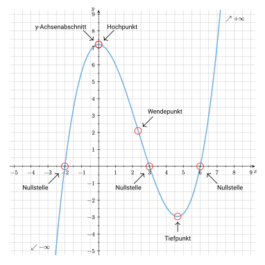

## Einleitung

Du hast dir zwischenzeitlich ein paar -- aus mathematischer Sicht -- mächtige Werkzeuge angeeignet. Diese werden nun von Nutzen sein, wenn es darum geht, Funktionen nähergehend zu untersuchen.

In der Mathematik ist es oft nicht ausreichend, eine Funktionsgleichung nur zu kennen -- vielmehr ist es entscheidend, ihre Eigenschaften genau zu analysieren.

Die sogenannte **Funktionsuntersuchung** -- oft auch **vollständige Kurvendiskussion** genannt -- liefert dir ein systematisches Vorgehen, um wichtige Merkmale wie Definitionsbereich, Nullstellen, Extrempunkte, Wendepunkte und das Verhalten im Unendlichen zu bestimmen. Diese Analyse bildet die Grundlage, um das Verhalten von Funktionen zu verstehen, zu interpretieren und in vielen Anwendungsbereichen gezielt einsetzen zu können.

In diesem Kapitel lernst du also Schritt für Schritt, wie du eine Funktion vollständig untersuchst.
Um zu verstehen, in welchen Anwendungsbereichen dies von Nutzen sein kann, widmen wir uns im Anschluss daran einem Anwendungsbeispiel.

## Vorgehen in diesem Kapitel

In diesem Kapitel findest du nicht nur die grundlegenden Definitionen und Erklärungen zur Vorgehensweise bei einer vollständigen Kurvendiskussion, sondern auch ein Beispiel, an dem alle Schritte durchgeführt und somit anschaulich nachvollzogen werden können.


    Nachfolgend betrachten wir beispielhaft die Funktion $f(x)=0,2x^3 - 1,4x^2 +7,2$ und führen eine vollständige Kurvendiskussion durch.


## Definitionsbereich


Der **Definitionsbereich** einer Funktion $f$ -- geschrieben: $\mathbb{D}(f)$ -- ist die Menge aller $x$-Werte,
für die die Funktion definiert ist.


Zur vollständigen Beschreibung einer Funktion -- wie das bei vollständigen Kurvendiskussion der Fall ist -- gehört die Angabe des <mark>Definitionsbereichs</mark>. Diesen bestimmt man, da es nur innerhalb dieses Bereiches sinnvoll ist, Untersuchungen über die Eigenschaften jener Funktion anzustellen.


Umgangssprachlich ausgedrückt umfasst der Definitionsbereich alle $x$-Werte (Argumente), die man in die Funktion einsetzen darf. Je nach Funktionsgleichung gibt es dafür Einschränkungen.

Im Allgemeinen gilt jedoch: $\mathbb{D}(f) = \mathbb{R}$.

Oder anders ausgedrückt: Man darf alle reellen Zahlen ($\mathbb{R}$) einsetzen.



    Auch bei der Funktion aus unserem Beispiel gilt: \
    $\mathbb{D}(f) = \mathbb{R}$.



Wie bereits erwähnt gibt es jedoch auch Ausnahmen. Hier siehst du zwei Beispiele:

**Wurzelfunktionen** wie z.B. $f(x) = \sqrt{x}$:

- Vielleicht erinnerst du dich an folgende Regel: Aus einer negativen Zahl kann man im Bereich der reellen Zahlen nur dann eine Wurzel ziehen, wenn der Wurzelexponent ungerade ist. Ist der Wurzelexponent gerade (wie das bei der Quadratwurzel $\sqrt{}$ der Fall ist), ist die Wurzel aus einer negativen Zahl nicht definiert.
- Es gilt deshalb $\mathbb{D}(f) = \mathbb{R}_0^+$.
- Umgangssprachlich ausgedrückt: Man darf alle positiven Zahlen inklusive der Null einsetzen.

 

**gebrochen-rationale Funktionen** wie bspw. $f(x) = \frac{1}{x}$:

- Durch Null zu teilen ist in der Mathematik nicht möglich und nicht definiert, da es widersprüchliche und nicht eindeutige Ergebnisse liefern würde.
- Deshalb gilt: $\mathbb{D}(f) = \mathbb{R}\backslash \{0\}$.
- Umgangssprachlich ausgedrückt: Man darf alle Zahlen (egal ob positiv oder negativ) außer der Null einsetzen.


## Achsenschnittpunkte

Wenn geklärt ist, wie der Definitionsbereich der Funktion lautet, dann überprüft man den Graphen der Funktion zunächst auf dessen <mark>Schnittpunkte mit den Koordinatenachsen</mark>:

- **Schnittpunkt mit der y-Achse:** \
Eine Funktion kann einen Schnittpunkt mit der $y$-Achse haben -- auch <mark>$y$-Achsenabschnitt</mark> genannt --, muss aber nicht zwingend.
Ein Beispiel für eine Funktion, welche keinen Schnittpunkt mit der $y$-Achse besitzt, ist die Funktion $f(x)=\frac1x$.

- **Schnittpunkte mit der x-Achse:** \
Man spricht hierbei von den sog. <mark>Nullstellen</mark> einer Funktion. Anders als bei der Begrifflichkeit Schnittpunkt bezeichnet eine Nullstelle lediglich den $x$-Wert (Stelle) eines Schnittpunkts mit der $x$-Achse. Alle Schnittpunkte mit der $x$-Achse haben die Form $(x_i|0)$, wobei $x_i$ hier repräsentativ für alle Nullstellen der Funktion steht.



- **Schnittpunkt mit der $y$-Achse:** \
$f(0)$ bestimmen $\quad \Rightarrow P(0|f(0))$

- **Schnittpunkte mit der $x$-Achse:** \
$f(x) = 0$ setzen und alle Nullstellen $x_i$ ausrechnen $\quad \Rightarrow (x_i|0)$




    In Abbildung 1 siehst du die jeweiligen Achsenschnittpunkte markiert.
    
    *Abb. 1: Achsenschnittpunkte des Funktionsgraphen*

- Den $y$-Achsenabschnitt erhält man, indem man entweder $f(0)$ bestimmt oder einfach das Absolutglied der Funktionsgleichung betrachtet: $7,2$ \
$\Rightarrow S_y(0|7,2)$.
- Die Nullstellen des Funktionsgleichung erhält man, indem man eine Polynomdivision durchführt und anschließend die p-q-Formel anwendet: \
$\Rightarrow x_1=-2, \quad x_2=3, \quad x_3=6$.


## Symmetrieeigenschaften

Die <mark>Symmetrieeigenschaft</mark> einer Funktion beschreibt, ob ihr Graph bei einer Spiegelung oder einer Drehung unverändert bleibt.

Dies führt zu zwei Haupttypen von Symmetrie:

- **Achsensymmetrie** (siehe grüner Graph):
    - Spiegelung an einer Achse (meist der $y$-Achse)
    - Notation: $f(x) = f(-x)$
- **Punktsymmetrie** (roter Graph):
    - Spiegelung an einem Punkt (meist dem Koordinatenursprung)
    - Notation: $f(-x) = -f(x)$.


    
        
        *Abb. 2: achsensymmetrischer Funktionsgraph*
    
    
        
        *Abb. 3: punktsymmetrischer Graph*
    


Bei ganzrationalen Funktionen kann die Symmetrie oft durch Betrachtung der (geraden oder ungeraden) Exponenten des Funktionsterms bestimmt werden:

- Hat eine Funktionsgleichung nur **gerade Exponenten**, so liegt eine **Achsensymmetrie** vor.
- Hat eine Funktionsgleichung ausschließlich **ungerade Exponenten**, so handelt es sich um eine **Punktsymmetrie** zum Koordinatenursprung.


In diesem Fall liegt weder eine Achsensymmetrie noch eine Punktsymmetrie vor, da die Funktionsgleichung sowohl ungerade ($x^3$) als auch gerade Exponenten ($x^2$ und $x^0$) enthält.

Sprich: Der Graph von $f$ ist nicht symmetrisch.

Formal kann man dies wie folgt nachweisen:

- Zunächst bildet man $f(-x)$: \
$f(-x) = 0,2 \cdot (-x)^3 - 1,4 \cdot (-x)^2 + 7,2 = -0,2x^3 - 1,4x^2 +7,2$
- Nun vergleicht man $f(-x)$ mit $f(x)$: \
$f(-x) = -0,2x^3 - 1,4x^2 +7,2 \neq 0,2x^3 - 1,4x^2 +7,2 = f(x)$
- Da $f(x) \neq f(-x)$ gilt, haben wir nachgewiesen, dass keine Achsensymmetrie vorliegt.

Analog funktioniert dies auch für den Nachweis der Punktsymmetrie (welche ebenfalls nicht vorliegt) mit dem Vergleich von $f(-x)$ und $-f(x)$.


## Extrempunkte

Extrempunkte einer Funktion sind die Punkte auf ihrem Graphen, an denen die Funktion entweder ihren höchsten Punkt (Hochpunkt/Maximum) oder ihren tiefsten Punkt (Tiefpunkt/Minimum) in einer lokalen Umgebung erreicht.
<!-- , was sich durch einen Wechsel der Monotonie von steigend zu fallend oder umgekehrt zeigt. -->


Man unterscheidet bei Extrempunkten -- oft auch Extrema genannt -- zwischen Hochpunkten und Tiefpunkten:

- **Hochpunkt (Maximum)**: Ein Punkt auf dem Graphen, an dem die Funktion lokal am höchsten ist. Der Graph steigt davor an und fällt danach wieder.
- **Tiefpunkt (Minimum)**: Ein Punkt auf dem Graphen, an dem die Funktion lokal am tiefsten ist. Der Graph fällt davor und steigt danach wieder an.



### Schritt 1

Zunächst bildet man die ersten <mark>drei Ableitungen</mark> der gesuchten Funktion. Wenn dir die Ableitungsregeln nicht mehr bekannt sind, dann wirf noch einmal einen Blick in das Kapitel "Grundlagen der Differentialrechnung" auf die Seite ["Erste Ableitungsregeln"](hbf1/3-grundlagen-der-differentialrechnung/erste-ableitungsregeln/).



Erste Ableitung: \
$f'(x)=0,6x^2-2,8x$

Zweite Ableitung: \
$f''(x)=1,2x-2,8$

Dritte Ableitung: \
$f'''(x)=1,2$


### Schritt 2

Als nächstes kümmern wir uns um die sogenannte <mark>notwendige Bedingung</mark>:


Die **notwendige Bedingung für eine Extremstelle** einer differenzierbaren Funktion ist, dass die erste Ableitung ($f'(x)$) an dieser Stelle gleich Null ist ($f'(x) = 0$), da die **Tangente** an dieser Stelle **waagerecht** ist (und ihre Steigung somit Null ist).


In Abbildung 4 sind diejenigen Stellen des Funktionsgraphen markiert, an denen eine waagerechte Tangente vorliegt:

*Abb. 4: Extrema und waagerechte Tangente*

Um diejenigen Stellen bestimmen zu können, an denen die Tangente waagerecht ist, müssen wir als nächstes die <mark>Nullstellen der ersten Ableitung bestimmen</mark>.


Die erste Ableitung einer Funktion $f(x)$ -- bezeichnet als $f'(x)$ -- gibt die **momentane Steigung des Funktionsgraphen an einer bestimmten Stelle** an.

Sie beschreibt die **lokale Änderungsrate** und ermöglicht die **Berechnung, wie steil der Graph in jedem Punkt ist**. Dies ist für die Ermittlung von Extrempunkten (Hoch- und Tiefpunkten) wichtig und für das Verständnis des Verhaltens des Funktionsgraphen (ob dieser steigend oder fallend ist) entscheidend.



Zur Erinnerung: \
$f'(x)=0,6x^2-2,8x$

Notwendige Bedingung:

$\begin{aligned}
&&f'(x) &=0 \\\
\Leftrightarrow &&0,6x^2-2,8x &= 0 \\\
\Leftrightarrow &&x \cdot (0,6x-2,8) &= 0
\end{aligned}$

$\Rightarrow x_1=0, \quad 0,6x_2-2,8=0 \\\
\Leftrightarrow x_1=0, \quad x_2 \approx 4,67$


Wir wissen nun, dass der Funktionsgraph an den Stellen $x_1=0$ und $x_2 \approx 4,67$ eine waagerechte Tangente besitzt und somit an diesen Stellen Extrempunkte vorliegen können.

### Schritt 3

Um zu überprüfen, welche Art von Extrempunkt vorliegt, nutzt man nun die <mark>hinreichende Bedingung</mark> von Extremstellen.


Dass die erste Ableitung an derjenigen Stelle des Funktionsgraphen gleich Null ist, an der sich eine Extremstelle befindet, ist jedoch **keine hinreichende Bedingung**. An solchen Stellen kann nämlich anstatt eines Hoch- oder Tiefpunkts auch ein sogenannter **Sattelpunkt** vorliegen.

Zur Überprüfung, ob tatsächlich ein Extrempunkt vorliegt, wird daher die zweite Ableitung ($f''(x)$) herangezogen:

- Ist $f''(x) < 0$ so liegt ein Hochpunkt vor,
- ist $f''(x) > 0$, handelt es sich um einen Tiefpunkt und
- wenn $f''(x) = 0$ ist, dann liegt ein Sattelpunkt vor.




Wenn $f'(x) = 0$ und gleichzeitig $f''(x) = 0$ ist, dann liegt kein Extrempunkt, sondern ein **Sattelpunkt** (auch *Terrassenpunkt* genannt) vor, bei dem die **Tangente waagerecht** ist, **aber kein lokales Maximum oder Minimum** vorliegt.



Zur Erinnerung: \
$f''(x)=1,2x-2,8$ und $x_1=0, \quad x_2 \approx 4,67$

Wir überprüfen die erste Extremstelle $x_1=0$: \
$f''(0)=1,2 \cdot 0 - 2,8 = -2,8 < 0 \Rightarrow$ Hochpunkt

Wir überprüfen die zweite Extremstelle $x_2 \approx 4,67$: \
$f''(4,67)=1,2 \cdot 4,67 - 2,8 = 2,804 > 0 \Rightarrow$ Tiefpunkt

*Abb. 5: Extremstellen*


Wir wissen nun, dass an der Stelle $x_1=0$ ein Hochpunkt und an der Stelle $x_2 \approx 4,67$ ein Tiefpunkt vorliegt.

### Schritt 4

Last but not least widmen wir uns den <mark>noch fehlenden Koordinaten</mark> der Extremstellen.
Diese rechnen wir aus, indem wir die $x$-Werte der Extremstellen in die Ausgangsfunktion einsetzen und die dazugehörigen Funktionswerte $f(x_i)$ an dieser Stelle berechnen.


Zur Erinnerung: \
$x_1=0, \quad x_2 \approx 4,67$

Wir rechnen den $y$-Wert des ersten Extrempunkts $x_1=0$ aus: \
$f(0)=0,2 \cdot 0^3 - 1,4 \cdot 0^2 + 7,2 = 7,2 \quad \Rightarrow HP(0|7,2)$

Wir rechnen den $y$-Wert des zweiten Extrempunkts $x_2 \approx 4,67$ aus: \
$f(0)=0,2 \cdot 4,67^3 - 1,4 \cdot 4,67^2 + 7,2 \approx -2,96 \quad \Rightarrow TP(4,67|-2,96)$

*Abb. 5: Extremstellen*


Wir kennen also nun die Koordinaten der Extrempunkte.

## Wendepunkte

Unsere Beispielfunktion hat zwei Extrema -- einen Hoch- und einen Tiefpunkt -- und somit zwei Stellen, an denen die Steigung des Funktionsgraphen Null ist. Das bedeutet folglich auch, dass es dazwischen eine Stelle geben muss, an der die Steigung extremal (d.h. minimal oder maximal) ist. Solche Stellen bzw. Punkte bezeichnet man als **Wendestellen bzw. -punkte**.


In einem Wendepunkt ändert sich das Krümmungsverhalten des Funktionsgraphen von $f(x)$ von $+$ nach $-$ oder von $-$ nach $+$. Zudem ist ein Wendepunkt derjenige Punkt zwischen zwei Extrempunkten, in dem der Graph die **kleinste bzw. größte Steigung** besitzt.


*Was ist zu tun?* \
Um diejenigen Stellen des Funktionsgraphen ausfindig zu machen, an denen sich Wendepunkte befinden, bestimmt man die <mark>Nullstellen der zweiten Ableitung</mark>.

*Warum ist das so?*
- Die Funktionsgleichung $f(x)$ liefert den passenden **Funktionswert** zu jedem $x$-Wert.
- Die Nullstellen der ersten Ableitung liefern uns diejenigen Stellen, an denen der Funktionsgraph Extrempunkte besitzt -- sprich: an denen der **Funktionswert extremal** (d. h. minimal oder maximal) ist.
- Die erste Ableitung $f'(x)$ liefert uns die **Steigung** des Funktionsgraphen.
- Somit liefert uns die zweite Ableitung $''f(x)$ -- welche man auch als die erste Ableitung der ersten Ableitung bezeichnen könnte -- diejenigen Stellen des Funktionsgraphen, an denen die **Steigung extremal** ist.

 


Um die Wendestellen zu ermitteln, bestimmen wir nun die Nullstellen der zweiten Ableitung:

$\begin{aligned}
f''(x)&=0 & \vert \text{notwendige Bedingung}\\\
\Leftrightarrow 1,2x-2,8&=0 & \vert +2,8 \\\
\Leftrightarrow 1,2x&=2,8 & \vert :1,2 \\\
x &\approx 2,33
\end{aligned}$

Anschließend überprüfen wir die Wendestelle mit der dritten Ableitung:

$f''(2,33)=1,2 > 0 \quad \Rightarrow$ R-L-Wendestelle

Und zu guter Letzt berechnen wir die $y$-Koordinate des Wendepunkts:

$f(2,33)=0,2 \cdot 2,33^3 - 1,4 \cdot 2,33^2 + 7,2 = 2,12$

Wir kennen nun also auch die genauen Koordinaten des Wendepunkts $(2,33|2,12)$.


*Abb. 6: Wendestellen des Funktionsgraphen*

### Zusammenhang zwischen Ausgangsfunktion und den Ableitungsfunktionen

In Abbildung 7 wird noch einmal der Zusammenhang zwischen Ausgangsfunktion, 1. Ableitung und 2. Ableitung aufgezeigt.

*Abb. 7: Funktionsgraph und Ableitungen*

<!-- ## Steigungs-, Krümmungs- und Monotonieverhalten

to be continued... -->

## Globalverhalten


Unter dem Globalverhalten versteht man auch die **Untersuchung der Randpunkte des Definitionsbereiches**.
Man untersucht sozusagen, in welche Richtung sich der Funktionsgraph bewegt, wenn die $x$-Werte unendlich groß ($x \rightarrow +\infty$) oder unendlich klein ($x \rightarrow -\infty$) werden.

Im Falle von ganzrationalen Funktionen sagt man, der Graph verläuft

- ins positiv Unendliche ($+\infty$) oder
- ins negativ Unendliche ($-\infty$).

 

Ist der Definitionsbereich nicht beschränkt -- was bspw. bei der Funktion $f(x)=\frac1x$ der Fall wäre --, dann sind lediglich die beiden folgenden Grenzwerte zu bestimmen:

- $\displaystyle \lim_{x \rightarrow +\infty} f(x)$ und
- $\displaystyle \lim_{x \rightarrow -\infty} f(x)$.

 

Bei ganzrationalen Funktionen betrachtet man dazu lediglich die höchste Potenz, da diese allein das Grenzverhalten bestimmt.



Es gibt auch Beispiele, in denen sich der Funktionsgraph (von oben oder unten) einem bestimmten Wert annähert -- wie z.B. der $0$ im Falle von $f(x)=\frac1x$.



Wir betrachten nur die höchste Potenz von $f(x)$, sprich: $0,2 \cdot x^3$ und bestimmen die beiden Grenzwerte:

- $\displaystyle \lim_{x \rightarrow +\infty} 0,2 \cdot x^3 = 0,2 \cdot (+\infty)^3 = +\infty$: \
    Eine positive Zahl dreimal mit sich selbst multipliziert ergibt wieder eine positive Zahl. Multipliziert man diese anschließend mit $0,2$, was wiederum eine positive Zahl ist, so erhält man wiederum eine positive Zahl: $+\infty$.
- $\displaystyle \lim_{x \rightarrow -\infty} 0,2 \cdot x^3 = 0,2 \cdot (-\infty)^3 = -\infty$ \
    Eine negative Zahl dreimal mit sich selbst multipliziert ergibt wieder eine negative Zahl. Multipliziert man diese anschließend mit einer positiven Zahl ($0,2$), so erhält man wiederum eine negative Zahl: $-\infty$.


## Skizze

Schlussendlich bietet es sich an, eine <mark>Skizze des Graphen</mark> anzufertigen (vgl. Abbildung 8). Hierzu ist weder eine genaue Zeichnung noch das Erstellen einer Wertetabelle erforderlich. Auf Basis der vorangegangenen Untersuchungspunkte lässt sich der Graph der Funktion bereits sehr gut und reduziert auf seine wesentlichen Merkmale bzw. Punkte skizzieren.

*Abb. 8: finale Skizze des Funktionsgraphen mit allen Punkten*

 
 

Um deine Ergebnisse zu überprüfen, kannst du gerne das nachfolgende GeoGebra-Widget nutzen:


