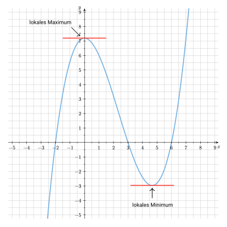

## Wendepunkte

Die Extrempunkte einer Funktion sind diejenigen Punkte des Funktionsgraphen, an denen der höchste Punkt (Hochpunkt/Maximum) oder der tiefste Punkt (Tiefpunkt/Minimum) in einer lokalen Umgebung erreicht wird.


Man unterscheidet bei **Extrempunkten** -- oft auch **Extrema** genannt -- zwischen Hochpunkten und Tiefpunkten:

- **Hochpunkt (Maximum)**: Ein Punkt auf dem Graphen, an dem die Funktion lokal am höchsten ist. Der Graph steigt davor an und fällt danach wieder.
- **Tiefpunkt (Minimum)**: Ein Punkt auf dem Graphen, an dem die Funktion lokal am tiefsten ist. Der Graph fällt davor und steigt danach wieder an.



### Schritt 1

Zunächst bildet man die ersten <mark>zwei Ableitungen</mark> der gesuchten Funktion. Wenn dir die Ableitungsregeln nicht mehr bekannt sind, dann wirf noch einmal einen Blick in das Kapitel "Grundlagen der Differentialrechnung" auf die Seite ["Erste Ableitungsregeln"](hbf1/3-grundlagen-der-differentialrechnung/erste-ableitungsregeln/).



Erste Ableitung: \
$f'(x)=0,6x^2-2,8x$

Zweite Ableitung: \
$f''(x)=1,2x-2,8$

<!-- Dritte Ableitung: \
$f'''(x)=1,2$ -->


### Schritt 2

Als nächstes kümmern wir uns um die sogenannte <mark>notwendige Bedingung</mark>:


Die **notwendige Bedingung für eine Extremstelle** einer differenzierbaren Funktion ist, dass die erste Ableitung ($f'(x)$) an dieser Stelle gleich Null ist ($f'(x) = 0$), da die **Tangente** an dieser Stelle **waagerecht** ist (und ihre Steigung somit Null ist).


In Abbildung 4 sind diejenigen Stellen des Funktionsgraphen markiert, an denen eine waagerechte Tangente vorliegt:


<!-- 
*Abb. 4: Extrema und waagerechte Tangente* -->

Um diejenigen Stellen bestimmen zu können, an denen die Tangente waagerecht ist, müssen wir als nächstes die <mark>Nullstellen der ersten Ableitung bestimmen</mark>.


Die erste Ableitung einer Funktion $f(x)$ -- bezeichnet als $f'(x)$ -- gibt die **momentane Steigung des Funktionsgraphen an einer bestimmten Stelle** an.

Sie beschreibt die **lokale Änderungsrate** und ermöglicht die **Berechnung, wie steil der Graph in jedem Punkt ist**. Dies ist für die Ermittlung von Extrempunkten (Hoch- und Tiefpunkten) wichtig und für das Verständnis des Verhaltens des Funktionsgraphen (ob dieser steigend oder fallend ist) entscheidend.



Zur Erinnerung: \
$f'(x)=0,6x^2-2,8x$

Notwendige Bedingung:

$\begin{aligned}
&&f'(x) &=0 \\\
\Leftrightarrow &&0,6x^2-2,8x &= 0 \\\
\Leftrightarrow &&x \cdot (0,6x-2,8) &= 0
\end{aligned}$

$\Rightarrow x_1=0, \quad 0,6x_2-2,8=0 \\\
\Leftrightarrow x_1=0, \quad x_2 \approx 4,67$


Wir wissen nun, dass der Funktionsgraph an den Stellen $x_1=0$ und $x_2 \approx 4,67$ eine waagerechte Tangente besitzt und somit an diesen Stellen Extrempunkte vorliegen können.

### Schritt 3

Um zu überprüfen, welche Art von Extrempunkt vorliegt, nutzt man nun die <mark>hinreichende Bedingung</mark> von Extremstellen.


<!-- Dass die erste Ableitung an derjenigen Stelle des Funktionsgraphen gleich Null ist, an der sich eine Extremstelle befindet, ist jedoch **keine hinreichende Bedingung**. An solchen Stellen kann nämlich anstatt eines Hoch- oder Tiefpunkts auch ein sogenannter **Sattelpunkt** vorliegen. -->

<!-- Zur Überprüfung, ob tatsächlich ein Extrempunkt vorliegt, wird daher die zweite Ableitung ($f''(x)$) herangezogen: -->
Zur Überprüfung, welche Art von Extrempunkt vorliegt, wird die zweite Ableitung ($f''(x)$) herangezogen und die Extremstellen $x_0$ eingesetzt:

- Ist $f''(x_0) < 0$ so liegt ein Hochpunkt vor,
- ist $f''(x_0) > 0$, handelt es sich um einen Tiefpunkt und
- wenn $f''(x_0) = 0$ ist, dann liegt dort ein sogenannter Sattelpunkt vor.




Wenn $f'(x) = 0$ und gleichzeitig $f''(x) = 0$ ist, dann liegt kein Extrempunkt, sondern ein **Sattelpunkt** (auch *Terrassenpunkt* genannt) vor, bei dem die **Tangente waagerecht** ist, **aber kein lokales Maximum oder Minimum** vorliegt.

Diesen Fall werden wir jedoch vernachlässigen.



Zur Erinnerung: \
$f''(x)=1,2x-2,8 \quad$ und $\quadx_1=0, \quad x_2 \approx 4,67$

Wir überprüfen die erste Extremstelle $x_1=0$: \
$f''(0)=1,2 \cdot 0 - 2,8 = -2,8 < 0 \quad \Rightarrow$ Hochpunkt

Wir überprüfen die zweite Extremstelle $x_2 \approx 4,67$: \
$f''(4,67)=1,2 \cdot 4,67 - 2,8 = 2,804 > 0 \quad \Rightarrow$ Tiefpunkt




Wir wissen nun, dass an der Stelle $x_1=0$ ein Hochpunkt und an der Stelle $x_2 \approx 4,67$ ein Tiefpunkt vorliegt.

### Schritt 4

Last but not least widmen wir uns den <mark>noch fehlenden Koordinaten</mark> der Extrempunkte.
Bisher kennen wir lediglich die jeweiligen $x$-Koordinaten. Die $y$-Koordinaten rechnen wir aus, indem wir die $x$-Werte der Extremstellen in die Ausgangsfunktion einsetzen und die dazugehörigen Funktionswerte $f(x_i)$ an dieser Stelle berechnen.


Zur Erinnerung: \
$x_1=0, \quad x_2 \approx 4,67$

Wir rechnen den $y$-Wert des ersten Extrempunkts $x_1=0$ aus: \
$f(0)=0,2 \cdot 0^3 - 1,4 \cdot 0^2 + 7,2 = 7,2 \quad \Rightarrow HP(0|7,2)$

Wir rechnen den $y$-Wert des zweiten Extrempunkts $x_2 \approx 4,67$ aus: \
$f(0)=0,2 \cdot 4,67^3 - 1,4 \cdot 4,67^2 + 7,2 \approx -2,96 \quad \Rightarrow TP(4,67|-2,96)$


Wir kennen also nun die Koordinaten der Extrempunkte:

