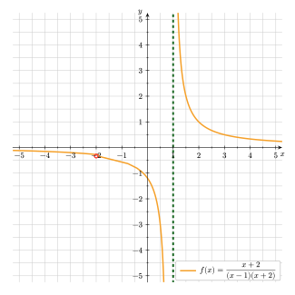

## Einleitung

In diesem Abschnitt werden die wichtigsten Schritte zur vollständigen Funktionsuntersuchung **gebrochen-rationaler Funktionen** systematisch erklärt und an einem Beispiel angewendet.

## Definitionsbereich

Bei ganzrationalen Funktionen (Polynomfunktionen) treten keine Nenner, Wurzeln oder Logarithmen auf. Daher ist der Funktionsausdruck bei ganzrationalen Funktionen für jeden reellen Wert von $x$ definiert und somit gilt $\mathbb{D}(f)=\mathbb{R}$ (heißt: der Definitionsbereich umfasst alle reellen Zahlen).

Es gibt jedoch auch andere Fälle, in denen der Funktionsausdruck näher untersucht werden muss.
Eine gebrochen-rationale Funktion bspw. ist an den Nullstellen ihres Nenners <mark>nicht definiert</mark>. Hierbei spricht man von den sogenannten **Definitionslücken**.

Allgemein geht man bei der Bestimmung des Definitionsbereichs bzw. der Definitionslücken wie folgt vor:

- Man prüft, ob der Ausdruck Brüche, Wurzeln oder Logarithmen enthält.
- Falls keiner dieser "Problemfälle" vorhanden ist (wie bei Polynomfunktionen), ist der Definitionsbereich $\mathbb{D} = \mathbb{R}$.
- Falls doch einer dieser Fälle eintritt (was bei gebrochen-rationalen Funktionen der Fall ist), so sind die "verbotenen Stellen" (Definitionslücken) aus dem Definitionsbereich auszuschließen.


Der **Definitionsbereich** einer Funktion $f$ -- geschrieben: $\mathbb{D}(f)$ -- ist die Menge aller $x$-Werte,
für die die Funktion definiert ist.

Seien $a$ und $b$ zwei reelle Zahlen (Notation: $a, b \in \mathbb{R}$).\
Die Schreibweise $\mathbb{D}(f) = \mathbb{R} \backslash \\{ a ; b \\}$ bedeutet, dass der Definitionsbereich alle reellen Zahlen außer $a$ und $b$ enthält -- wobei $a$ und $b$ die sogenannten _Definitionslücken_ sind.


Um die Definitionslücken einer gebrochen-rationalen Funktion zu bestimmen, betrachtet man die Nullstellen des Nenners, da die Funktion für diese Werte nicht definiert ist.

_Warum?_ \
Weil man nicht durch Null teilen darf.

{{< box-example title="Beispiel $\displaystyle f(x)=\frac{x-1}{x^2-4}$" >}}
Der Nenner $N(x)$ darf nicht Null werden. Wir setzen ihn also bewusst gleich Null, um dessen Nullstellen herauszufinden und diese dann aus dem Definitionsbereich auszuschließen.

$N(x) = 0 \qquad \Leftrightarrow \qquad x^2 - 4 = 0$.

Ergebnis: $x_{1/2} = \pm 2$.

Es gilt daher:
$\mathbb{D}(f) = \mathbb{R} \backslash \\{ -2 ; 2 \\}$.

Gesprochen:
"Der Definitionsbereich umfasst alle reellen Zahlen außer $-2$ und $2$."


## Art der Definitionslücke und Vorzeichenwechsel

Als Nächstes untersucht man die Definitionslücke und fragt sich: "Was ist hier besonderes los?".


Das Verhalten der Funktionswerte in der direkten Umgebung der **Definitionslücke** kann stark variieren, was man an dem folgenden Graphen gut erkennen kann:

1. An der Stelle $1$ hat der Graph von $f$ eine Lücke, welche den Graphen in zwei "Äste" unterteilt (vgl. grüne gestrichelte Linie).
2. Hingegen scheint an der Stelle $-2$ einfach nur ein Punkt des Graphen zu fehlen (roter Kreis).


Wir untersuchen also nun die Definitionslücke genauer und schauen, um welche Art von Lücke es sich hierbei handelt.
Setzt man die Nullstelle des Nenners -- die wir soeben bestimmt haben -- in den Zähler ein und erhält einen Wert ungleich Null, so handelt es sich um eine sog. **Polstelle** (_Unendlichkeitsstelle_ bzw. _senkrechte Asymptote_).


Wird der Funktionsgraph durch die Definitionslücke in zwei Äste unterteilt (wie im Bsp. zuvor im Fall 1), so spricht man von einer sog. **Polstelle** bzw. **senkrechten Asymptote**.
Scheint lediglich ein Punkt des Funktionsgraphen "zu fehlen", so handelt es sich um eine **hebbare Definitionslücke**.


{{< box-example title="Beispiel $\displaystyle f(x)=\frac{x-1}{x^2-4}$" >}}
Wir haben soeben bestimmt, dass die Nullstellen des Nenners an den Stellen $x_1 = -2$ und $x_2 = +2$ sind.

Wir überprüfen nun, um welche Art von Definitionslücke es sich handelt, indem wir nun $x_1 = -1$ und $x_2 = +2$ in den Zähler einsetzen:

- $Z(-2) = -2-1 = -3 \neq 0 \qquad \Rightarrow$ Polstelle.
- $Z(+2) = +2-1 = 1 \neq 0 \qquad \Rightarrow$ Polstelle.

Wir erhalten jeweils einen Wert _ungleich Null_, was bedeutet, dass der Funktionsgraph an diesen beiden Stellen jeweils eine **Polstelle** (_senkrechte Asymptote_) besitzt.



Käme beim Einsetzen der Nullstelle des Nenners in den Zähler ebenfalls der Wert Null heraus, so handelt es sich in diesem Fall um eine **hebbare Lücke**. In einem solchen Fall wäre es also möglich, die Lücke "zu beheben", in dem man eine Polynomdivision durchführt. In solchen Fällen erhält man eine ganzrationale Funktion als Ergebnis, deren Graph gleich verläuft, jedoch an den Lücken des Definitionsbereich keine Lücken enthält.

Diesen Fall werden wir hier jedoch vernachlässigen.


Als nächstes untersucht man, wie sich der Funktionsgraph links und rechts von der soeben gefundenen Polstelle verhält. Hierzu schaut man sich die Vorzeichen der Funktionswerte an, die links ($x_l < x_P$) bzw. rechts ($x_r > x_P$) von der Polstelle ($x_P$) liegen, indem man jene Werte in die Funktionsgleichung einsetzt.


Sei ein Funktionsgraph $f(x)$ mit einer Polstelle $x_P$ gegeben. Außerdem seien $x_l$ und $x_r$ zwei Funktionswerte, die links ($x_l < x_P$) bzw. rechts ($x_r > x_P$) von der Polstelle liegen. Dann gilt:

- $f(x_l) > 0 \quad$ und $\quad f(x_r) > 0 \qquad \Rightarrow \qquad$ Polstelle ohne Vorzeichenwechsel
- $f(x_l) < 0 \quad$ und $\quad f(x_r) < 0 \qquad \Rightarrow \qquad$ Polstelle ohne Vorzeichenwechsel
- $f(x_l) < 0 \quad$ und $\quad f(x_r) > 0 \qquad \Rightarrow \qquad$ Polstelle mit Vorzeichenwechsel.
- $f(x_l) > 0 \quad$ und $\quad f(x_r) < 0 \qquad \Rightarrow \qquad$ Polstelle mit Vorzeichenwechsel.





- Polstellen ohne Vorzeichenwechsel nennt man **gerader Pol**.
- Polstellen mit Vorzeichenwechsel nennt man **ungerader Pol**.

Im Falle eines ungeraden Pols passiert an der Polstelle ein "Sprung" von $+\infty$ nach $-\infty$ oder umgekehrt.



## Achsenschnittpunkte

### Nullstellen

Um die Nullstellen des Funktionsgraphen zu bestimmen, genügt es, die Nullstellen des Zählers zu betrachten. Setzt man nämlich den Funktionsterm gleich Null, so muss man als nächstes (da es sich im Falle einer gebrochen-rationalen Funktion um eine Bruchgleichung handelt) ohnehin mit dem Nenner multiplizieren, sodass dieser wegfällt und für die Gleichung irrelevant ist.


    Die Nullstellen des Zählers stellen die Nullstellen des Funktionsgraphen einer gebrochen-rationalen Funktion dar. Diese ermittelt man, indem man den Zähler gleich Null setzt und die Lösung(en) der Gleichung mit Hilfe bereits bekannter Verfahren wie bspw. der Äquivalenzumformung, Wurzelziehen, der p-q-Formel oder der Polynomdivision bestimmt.


{{< box-example title="Beispiel $\displaystyle f(x)=\frac{x-1}{x^2-4}$" >}}
Der Nenner $N(x)$ darf nicht Null werden. Wir setzen ihn also bewusst gleich Null, um dessen Nullstellen herauszufinden und diese dann aus dem Definitionsbereich auszuschließen.

$Z(x) = 0 \qquad \Leftrightarrow \qquad x - 1 = 0$.

Ergebnis: $x = 1$.

Der Graph hat somit die Nullstelle $x_1 = 1$.


### $y$-Achsenabschnitt


    Um den $y$-Achsenabschnitt des Funktionsgraphen zu bestimmen, genügt es, $x=0$ in den Funktionsterm einzusetzen und den Funktionswert zu berechnen.


{{< box-example title="Beispiel $\displaystyle f(x)=\frac{x-1}{x^2-4}$" >}}
Der Nenner $N(x)$ darf nicht Null werden. Wir setzen ihn also bewusst gleich Null, um die Lösung der Gleichung zu bestimmen und diese dann aus dem Definitionsbereich auszuschließen.

$\displaystyle f(0)=\frac{0-1}{0^2-4} = \frac{-1}{-4} = \frac14$

Der Funktionsgraph schneidet die $y$-Achse also im Punkt $\left( 0; \frac14 \right)$.


## Übung macht den Meister



1. $\displaystyle f(x)=\frac{x^2+1}{x}$
1. $\displaystyle f(x)=\frac{x^3+2}{2x^2}$
1. $\displaystyle f(x)=-\frac{1}{x^2} - \frac{1}{3}x$
1. $\displaystyle f(x)=\frac{x(0,5x+0,4)}{0,2x-1}$
1. $\displaystyle f(x)=\frac{(x+3)(x-1)}{(6-3x)(4x-8)}$
1. $\displaystyle f(x)=\frac{(6x-3)(2x-5)}{(2x-4)(4x-10)}$


