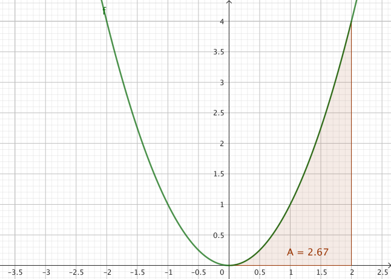

## Ober- und Untersumme

Eine Möglichkeit, um den Flächeninhalt zwischen dem Funktionsgraphen und der $x$-Achse (oder kurz: unterhalb eines Funktionsgraphen) zu bestimmen, ist das Berechnen der sogenannten **Ober- und Untersumme**.

Obersumme und Untersumme dienen in der Integralrechnung dazu, den Flächeninhalt unter einem Funktionsgraphen <mark>näherungsweise</mark> durch Rechtecke zu berechnen (man spricht hierbei von einer sogenannten *Approximation*). Die **Untersumme** (die Summe der kleineren Rechtecke) liegt vollständig unter dem Funktionsgraphen (und ist somit kleiner als die wahre Fläche des Funktionsgraphen), während die **Obersumme** (die Summe der großen Rechtecke) darüber liegt (und somit größer als die wahre Fläche ist).


Zunächst wird das Intervall $[a; b]$ wird in $n$ gleich breite Teilabschnitte unterteilt. Die Breite dieser Teilabschnitte (und somit später der einzelnen Rechtecke) beträgt dann $\frac{b-a}{n}$.

1. Bei der Untersumme wird jedes Rechteck stets unter dem Funktionsgraph eingezeichnet. Der **kleinste Funktionswert** in jedem Teilbereich gibt dabei die Höhe des Rechtecks an.
2. Bei der Obersumme wird das Rechteck immer über der Kurve eingezeichnet. Hierbei gibt der **größte Funktionswert** in jedem Teilbereich die Höhe des Rechtecks an.




In diesem Beispiel wollen wir den Flächeninhalt zwischen dem Funktionsgraphen von $f$ mit $f(x)=x^2$ und der $x$-Achse im Intervall von $0$ bis $2$ bestimmen.


Mit Hilfe von GeoGebra und dem Befehl  lässt sich dies ganz einfach realisieren und wir erhalten $A=2,67$.

Zerlegt man nun das Intervall in drei ($n=3$) gleich große Abschnitte, so erhält man folgende Ober- sowie Untersummen:






Erhöht man nun schrittweise $n$, so erhält man folgende Ergebnisse:






Und für $n=30$ ist bereits eine deutliche Annäherung an die "wahre Fläche" erkennbar:









Grundsätzlich gilt: \
Je mehr Rechtecke eingezeichnet werden (sprich: je größer $n$ ist), desto genauer ist die Annäherung an die wahre Fläche unterhalb des Funktionsgraphen.

*Was sich daraus folgern lässt?* \
Den Grenzwert von Ober- und Untersumme bezeichnet man als das sog. **Integral von $f$ in den Grenzen von $a$ bis $b$**.


Bestimmtes Integral

Unbestimmtes Integral

Beide erhält man, indem man eine Stammfunktion von f bildet.

Eine solche Stammfunktion erhält man, indem man die folgenden Regeln zum Aufleiten anwendet.
